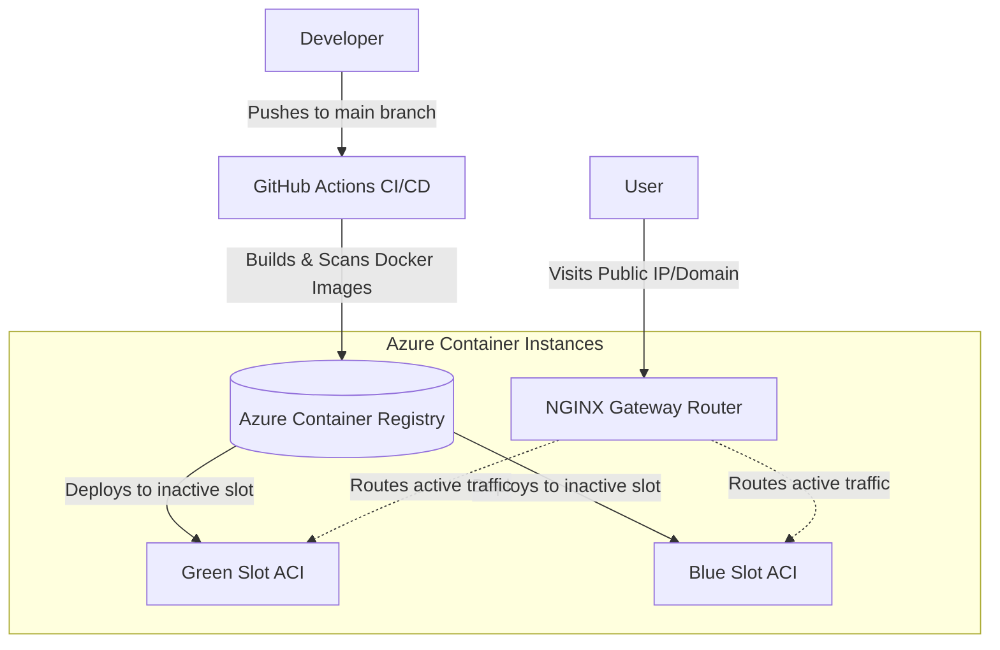

# Cloud-Native Blue/Green CI/CD Pipeline Template

Welcome to the Cloud-Native Blue/Green Deployment Template! This repository is designed to be a **reusable pipeline template** for any web application (e.g., MERN, Next.js, PERN stacks) deploying to Azure Container Instances (ACI). 

Currently, this repository contains a placeholder "Tea Stall" application, but it is structurally built so you can easily strip out the dummy code and insert your own frontend and backend projects smoothly.

## 🏗️ Architecture Flow

The CI/CD pipeline ensures zero-downtime deployments via a dynamically routed NGINX gateway.



---

## 🚀 1. How to Setup the Infrastructure (From Scratch)

If you have deleted all your Azure resources and are starting on a blank slate, follow these steps to recreate the necessary Azure backbone for the pipeline.

### Prerequisites
1. Install [Azure CLI](https://docs.microsoft.com/en-us/cli/azure/install-azure-cli) locally.
2. Run `az login` in your terminal to authenticate.

### Manual Provisioning via Azure CLI
Run the following commands in your terminal to easily spin up the baseline resource group and container registry. The pipeline will automate the rest!

```bash
# 1. Define Variables
RG_NAME="rg-app-prod"
LOCATION="centralindia"
ACR_NAME="myappregistry$(RANDOM)" # Must be globally unique across all Azure users

# 2. Create the Resource Group
az group create --name $RG_NAME --location $LOCATION

# 3. Create the Azure Container Registry (Basic SKU is the cheapest variant)
az acr create --resource-group $RG_NAME \
              --name $ACR_NAME \
              --sku Basic \
              --admin-enabled true
```

### Required GitHub Secrets
Once created, map the following secrets into your GitHub repository settings under **`Settings > Secrets and variables > Actions`**:

*   **`AZURE_CREDENTIALS`**: 
    To generate this, open your terminal and run the included helper script:
    * **Windows:** `.\scripts\generate_credentials.ps1`
    * **Mac/Linux:** `bash ./scripts/generate_credentials.sh`
    The script will automatically authenticate with Azure and output the exact JSON block you need to copy and paste directly into the secret.
*   **`ACI_RESOURCE_GROUP`**: The exact name you used for `$RG_NAME`.
*   **`ACR_LOGIN_SERVER`**: The URL of your registry, usually `<your-acr-name>.azurecr.io`
*   **`ACR_USERNAME`**: The ACR Admin username (found in Azure Portal -> The ACR Resource -> Access Keys).
*   **`ACR_PASSWORD`**: The ACR Admin password.
*   **`CLIENT_BASE_NAME`**: Set to `client-myapp` (or any label you want for your frontend).
*   **`SERVER_BASE_NAME`**: Set to `server-myapp` (or any label you want for your backend).
*   **`NGINX_DNS_LABEL`**: Must be globally unique, e.g., `nginx-router-myapp888`.

---

## 🔁 2. How to Swap the Dummy App with Your Own Code

This repository logically separates the stack into 3 core standalone directories:
1. `client/` - The frontend application (currently a dummy Next.js App)
2. `server/` - The backend API (currently a dummy Node.js App)
3. `nginx/` - The Gateway Configuration (**Leave this alone**, it is highly coupled to the CD script to handle the Blue/Green traffic routing algorithm).

**To integrate your own application:**
1. Delete all the files inside the `client/` folder. Paste your own React/Next.js/Vue frontend code inside it.
2. Delete all the files inside the `server/` folder. Paste your backend API (Node/Python/Go) inside it.
3. **CRITICAL:** Ensure both your new `client` and `server` folders have their own valid `Dockerfile` at their root level. The CI/CD pipeline hardcodes its search for exactly `./client/Dockerfile` and `./server/Dockerfile`.
4. The NGINX proxy routes traffic assuming your server exposes `PORT 8080`, and your client exposes `PORT 3000`. Please update your apps to run on these ports, or modify them in `cd.yml` and `nginx/nginx.conf`.

Once pushed to `main`, the GitHub Action detects your new code, packages it, and deploys it automatically without you touching Azure!

---

## 📊 3. Monitoring, Logs, and Deployment Tracking

### Where to see how things are working?
Since this architecture utilizes serverless Azure Container Instances (ACI), you do not need to configure complex Kubernetes clusters or Prometheus logging. It is built natively into Azure.

1. **Viewing Live Application Logs:** 
   * Navigate to the **Azure Portal**.
   * Go to your **Resource Group** (`rg-app-prod`).
   * Click on the currently running Container Instance (e.g., `client-myapp-green` or `nginx-router-myapp888`).
   * On the left sidebar panel, click **Containers** -> **Logs**. Here you will see the exact live `console.log` stream and standard output of your software.
   
2. **Viewing Server Health & Metrics:**
   * In that same Container Instance blade, click **Metrics** on the left sidebar to chart out CPU usage, Memory limits, and Network Bytes received.

3. **Where to track Deployment Time?**
   * Go to the **Actions** tab on your GitHub Repository.
   * Click on the latest workflow run. The UI will show you precisely which jobs ran (Linting, Scanning, Building, Deploying) and exactly how long the pipeline took to complete the Blue/Green swap (typically around 3-5 minutes).

---

## 🛡️ Built-in Quality Controls

* **Zero-Downtime:** The NGINX router Hot-Reloads the traffic configuration seamlessly. Users will not drop connections during an update.
* **Code Scanning:** `ci.yml` embeds Trivy image scanning, ensuring no Docker image with a Critical OS-level Vulnerability reaches production.
* **Cost Optimized:** `cd.yml` includes an aggressive teardown step. Only one production slot runs at a time. The unused backup containers are deleted instantly after a successful deployment, cleanly halving your Azure billing.
