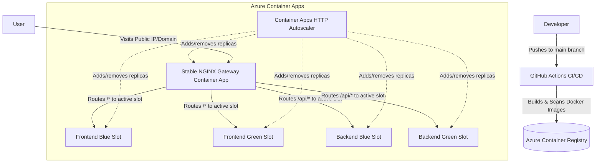

# Cloud-Native Azure Container Apps CI/CD Pipeline Template

Welcome to the Cloud-Native Azure Container Apps Deployment Template. This repository is designed to be a **reusable pipeline template** for any web application (for example MERN, Next.js, or PERN stacks) deploying to Azure Container Apps with HTTP autoscaling.

Currently, this repository contains a placeholder "Tea Stall" application, but it is structurally built so you can easily strip out the dummy code and insert your own frontend and backend projects smoothly.

## 🏗️ Architecture Flow

The CI/CD pipeline builds container images, pushes them to Azure Container Registry, and deploys the app stack to Azure Container Apps behind an NGINX gateway with blue-green slot switching.


```mermaid
graph TD;
    Developer-->|Pushes to main branch|GitHubActions[GitHub Actions CI/CD]
    GitHubActions-->|Builds & Scans Docker Images|ACR[(Azure Container Registry)]
    
    subgraph Azure Container Apps
        NGINX[Stable NGINX Gateway Container App]
        ClientBlue[Frontend Blue Slot]
        ClientGreen[Frontend Green Slot]
        ServerBlue[Backend Blue Slot]
        ServerGreen[Backend Green Slot]

        NGINX-->|Routes /* to active slot|ClientBlue
        NGINX-->|Routes /* to active slot|ClientGreen
        NGINX-->|Routes /api/* to active slot|ServerBlue
        NGINX-->|Routes /api/* to active slot|ServerGreen
        ACA[Container Apps HTTP Autoscaler]
        ACA-.->|Adds/removes replicas|NGINX
        ACA-.->|Adds/removes replicas|ClientBlue
        ACA-.->|Adds/removes replicas|ClientGreen
        ACA-.->|Adds/removes replicas|ServerBlue
        ACA-.->|Adds/removes replicas|ServerGreen
    end
    
    User-->|Visits Public IP/Domain|NGINX
```

---

## Scaling and Load Balancing

Scaling and load balancing are now handled by Azure Container Apps:

* **Terraform baseline:** `infra/main.tf` creates the shared Azure Container Apps environment and Log Analytics workspace.
* **GitHub Actions deployment:** `.github/workflows/pipeline.yml` deploys the inactive `blue` or `green` server and client slot, validates it behind a fresh NGINX revision, then flips the public gateway only after smoke tests pass.
* **Autoscaling:** each Container App has an HTTP concurrency scale rule with configurable min/max replicas.
* **Blue-green cutover:** NGINX remains the stable public endpoint while the workflow alternates between `server-<slot>` and `client-<slot>` Container Apps. After a successful switch, the replaced slot is deleted.
* **Load balancing:** Azure Container Apps automatically load balances traffic across healthy replicas of the active slot. NGINX routes `/api/*` to the backend slot URL and all other traffic to the frontend slot URL.
* **Local Compose:** `docker-compose.yml` still runs the same gateway pattern locally using `BACKEND_UPSTREAM_URL` and `CLIENT_UPSTREAM_URL`.

To tune production scale, add or update GitHub Actions repository variables:

```text
SERVER_MIN_REPLICAS=0
SERVER_MAX_REPLICAS=10
SERVER_HTTP_CONCURRENCY=50
CLIENT_MIN_REPLICAS=0
CLIENT_MAX_REPLICAS=5
CLIENT_HTTP_CONCURRENCY=80
NGINX_MIN_REPLICAS=1
NGINX_MAX_REPLICAS=5
NGINX_HTTP_CONCURRENCY=100
```

Set `MIN_REPLICAS=0` for the cheapest scale-to-zero behavior. Set `MIN_REPLICAS=1` if you want fewer cold starts.

---

## 🚀 1. How to Setup the Infrastructure (From Scratch)

If you have deleted all your Azure resources and are starting on a blank slate, follow these steps to recreate the necessary Azure backbone for the pipeline.

### Prerequisites
1. Install [Azure CLI](https://docs.microsoft.com/en-us/cli/azure/install-azure-cli) locally.
2. Run `az login` in your terminal to authenticate.

### Manual Provisioning via Azure CLI
Run the following commands in your terminal to easily spin up the baseline resource group and container registry. The pipeline will automate the rest!

```bash
# 1. Define Variables
RG_NAME="rg-app-prod"
LOCATION="centralindia"
ACR_NAME="myappregistry$(RANDOM)" # Must be globally unique across all Azure users

# 2. Create the Resource Group
az group create --name $RG_NAME --location $LOCATION

# 3. Create the Azure Container Registry (Basic SKU is the cheapest variant)
az acr create --resource-group $RG_NAME \
              --name $ACR_NAME \
              --sku Basic \
              --admin-enabled true
```

### Required GitHub Secrets
Once created, map the following secrets into your GitHub repository settings under **`Settings > Secrets and variables > Actions`**:

*   **`AZURE_CREDENTIALS`**: 
    To generate this, open your terminal and run the included helper script:
    * **Windows:** `.\scripts\generate_credentials.ps1`
    * **Mac/Linux:** `bash ./scripts/generate_credentials.sh`
    The script will automatically authenticate with Azure and output the exact JSON block you need to copy and paste directly into the secret.
*   **`ACI_RESOURCE_GROUP`**: The exact name you used for `$RG_NAME`. The name is kept for backwards compatibility with the existing workflow.
*   **`ACR_NAME`**: The short ACR name, for example `myappregistry123`.
*   **`CLIENT_BASE_NAME`**: Base Azure Container App name for the frontend slot pair, for example `client-myapp` which becomes `client-myapp-blue` and `client-myapp-green`.
*   **`SERVER_BASE_NAME`**: Base Azure Container App name for the backend slot pair, for example `server-myapp` which becomes `server-myapp-blue` and `server-myapp-green`.
*   **`NGINX_DNS_LABEL`**: Azure Container App name for the stable public gateway, for example `nginx-myapp`.

---

## 🔁 2. How to Swap the Dummy App with Your Own Code

This repository logically separates the stack into 3 core standalone directories:
1. `client/` - The frontend application (currently a dummy Next.js App)
2. `server/` - The backend API (currently a dummy Node.js App)
3. `nginx/` - The gateway configuration that routes browser traffic to the active frontend slot and `/api/*` traffic to the active backend slot.

**To integrate your own application:**
1. Delete all the files inside the `client/` folder. Paste your own React/Next.js/Vue frontend code inside it.
2. Delete all the files inside the `server/` folder. Paste your backend API (Node/Python/Go) inside it.
3. **CRITICAL:** Ensure both your new `client` and `server` folders have their own valid `Dockerfile` at their root level. The CI/CD pipeline hardcodes its search for exactly `./client/Dockerfile` and `./server/Dockerfile`.
4. The NGINX proxy routes traffic assuming your server exposes `PORT 8080`, and your client exposes `PORT 3000`. Please update your apps to run on these ports, or modify `.github/workflows/pipeline.yml` and `nginx/nginx.conf`.

Once pushed to `main`, the GitHub Action detects your new code, packages it, and deploys it automatically without you touching Azure!

---

## 📊 3. Monitoring, Logs, and Deployment Tracking

### Where to see how things are working?
Since this architecture uses Azure Container Apps, replica count, CPU, memory, requests, and logs are available in the Azure Portal under each Container App slot and the stable gateway.

1. **Viewing Live Application Logs:** 
   * Navigate to the **Azure Portal**.
   * Go to your **Resource Group** (`rg-app-prod`).
   * Click on the currently running Container App, for example `client-myapp-blue`, `client-myapp-green`, `server-myapp-blue`, `server-myapp-green`, or `nginx-myapp`.
   * Open **Log stream** or the connected **Log Analytics** workspace to inspect runtime logs.
   
2. **Viewing Server Health & Metrics:**
   * In that same Container App blade, click **Metrics** to chart replica count, requests, CPU, memory, and network usage.

3. **Where to track Deployment Time?**
   * Go to the **Actions** tab on your GitHub Repository.
   * Click on the latest workflow run. The UI shows validation, scanning, image build, Container Apps deployment, smoke tests, and DORA metric publishing.

4. **Where to track live traffic, scaling, slot, and build metadata?**
   * Open Grafana and use the `Azure Container Apps Runtime Analysis` dashboard.
   * It shows active slot/build/SHA metadata, current running replicas, configured min/max replica settings, traffic, CPU, memory, and restarts for the live Container Apps.

---

## 🛡️ Built-in Quality Controls

* **Autoscaling:** Azure Container Apps scales the stable NGINX gateway and the active blue or green frontend and backend slot based on concurrent HTTP traffic.
* **Code Scanning:** `ci.yml` embeds Trivy image scanning, ensuring no Docker image with a Critical OS-level Vulnerability reaches production.
* **Cost Optimized:** Container Apps can scale to zero when `MIN_REPLICAS=0`; keep `MIN_REPLICAS=1` only where you want warm capacity.
